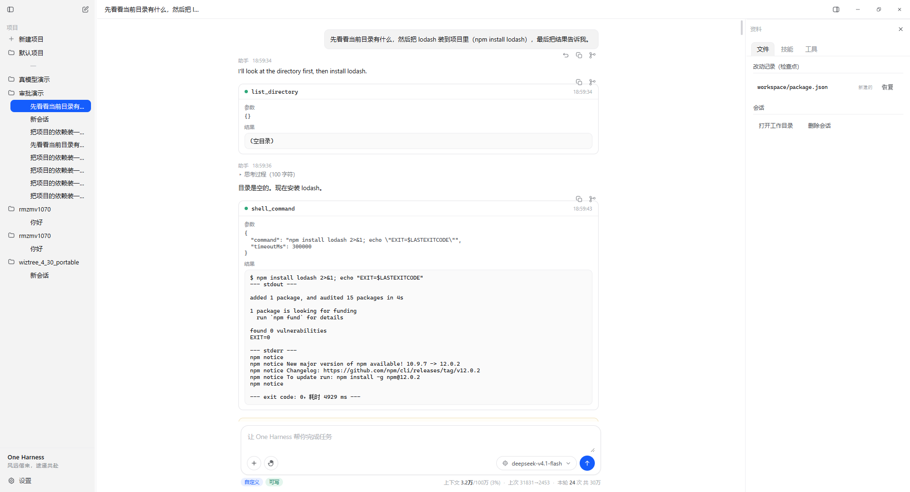
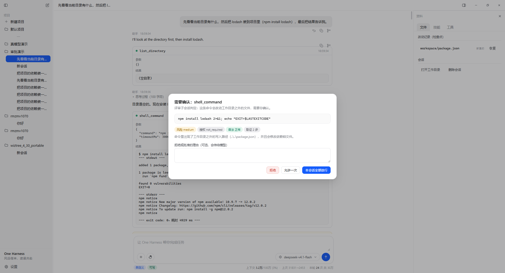

# One Harness —— 本地优先的 agent harness（桌面版）

> 风远偕来，途遥共赴

一个跑在本机的桌面 agent harness：接 OpenAI 兼容端点（本机 LM Studio / Ollama / 各类代理都行），
让模型在你的机器上读写文件、执行命令、联网取资料，每一步都过审批闸门、都能回滚。

内核、工具层、审批闸门、检查点、技能系统全部自己实现，纯 JS/HTML/CSS，**无构建步骤**。

**关于名字**：应用名 One Harness（图标就是「One」，`assets/icon.ico`，由 `tools/make-icon.js` 生成）。
工程目录仍叫 `hatch/`、环境变量仍是 `HATCH_*` 前缀 —— 那些是内部标识，
改名会连带作废已有的落盘布局与全部测试钩子，所以只改对外可见的名字。

---

## 快速开始

```bash
cd hatch
npm install            # 只装 electron（约 150MB）
npm start              # 或者双击 start.cmd
```

首次启动会：创建 `data/`、建一个"默认项目"、把工作目录指向 `data/projects/<id>/workspace`。

**接模型**（二选一）：

1. **本机那个 OpenAI 兼容代理（默认）**
   - 端点 `http://127.0.0.1:8787/v1`，模型 `deepseek-v4.1-flash`，**开箱即用，不用改设置**。
   - 只填到 `/v1` 就行（`/chat/completions` 由客户端自己拼；就算你把整段路径粘进 Base URL，也会被自动剥掉）。
   - 该代理的 `/v1/models` 会列出好几个模型，但**只有参数面板里当前选中的那个能用**，别的名字回车会 404 `model_not_found`。所以模型名以面板选中项为准，界面上随时可换。
2. **任何 OpenAI 兼容端点**：在「设置」里改 Base URL / API Key / 模型名，点「拉取模型列表」确认连通。
   - 本机 LM Studio：`http://127.0.0.1:1234/v1`（记得加载一个**支持工具调用**的模型，并在 Developer/Server 页开启本地服务或 `lms server start`）。
   - 设置里模型名留空、或填的名字在这个端点上不存在时，会自动改用端点 `/v1/models` 的第一个并落盘，界面上的模型 chip 立刻显示实际在用的那个。

跑一次自检：

```bash
npm test               # 内核 + UI 点击 + 真实鼠标 + 运行中切审批模式 + 布局字段校验 + 启动自检
npm run smoke          # 97 项内核断言，用假模型服务跑通整轮（不需要真模型）
npm run test:ui        # 真起 Electron 点一遍界面（不显示窗口），断言"点了要有反应"
npm run test:mouse     # 真实鼠标/键盘输入（走 Chromium 命中测试），断言"这个控件真人点得到"
npm run test:bionic    # 布局字段校验：确认应用的 ui-state 字段名都有据可依
npm run test:approval-mode  # 专项：会话跑着的时候切审批模式，必须真的对下一次工具调用生效（自带桩模型，约 20 秒）
npm run test:features  # 全功能巡检 131 项：面板/布局/会话增删改/内置浏览器/文件预览与行号/设置模态框/真模型工具调用/审批/回滚/分叉（约 3~5 分钟）
npm run launch-check   # 确认主进程+preload+渲染层能起来
```

`test:ui` 和 `test:mouse` 分工不同，**两个都要跑**：

- `test:ui` 在渲染层跑脚本、点击用 `el.click()`。快、能覆盖业务链路，但它**绕过命中测试**——
  元素被 `visibility:hidden`、宽 0、被遮挡、落在 `-webkit-app-region` 拖拽区里，它照样触发 `onclick`。
- `test:mouse` 只发真实输入（主进程走 CDP 的 `Input.*`，等同真人操作），并用 `document.elementFromPoint`
  校验"这个点上最顶层到底是谁"。**"按钮点不到"这类问题只有它能测出来**（左栏收起后收不回来的死锁就是这么漏掉的）。
  覆盖：点击 / 悬停 / 拖拽分隔条 / 双击折叠 / 滚轮 / 真实键盘输入，外加一遍**全量体检**——
  枚举界面上每个可见交互元素做命中测试，凡是"看得见却点不着"的都算失败。

> `test:mouse` 需要一个**真正显示出来**的窗口：屏幕外和隐藏的窗口合成帧率极低，
> `mouseMoved` 会被 Chromium 攒着不派发、滚轮事件甚至完全合成不出来（实测连 `document` 级的
> `mousemove` 都是 0 条）。所以跑它的时候屏幕上会出现一个 One Harness 窗口；要安静跑就设
> `HATCH_MOUSE_OFFSCREEN=1`（点击/拖拽/键盘仍然可靠，悬停与滚轮会不准）。

**两条兜底的排查手段**（只在"CDP 合成输入测不出来"时才用得上）：

- **原始指针移动 / 指定点点击**：`HATCH_MOUSE_FILE` 里的 steps 模块能拿到 `move(x, y)` 与
  `clickAt(x, y, label)`。`click(sel)` 内部固定先到 (3,3) 再到目标，也就是**只能从左上方向接近**；
  而"鼠标从某个方向移进去就点不动"这类问题必须自己控制接近路径。
- **真·系统鼠标**：`test/native-click.py`（Windows / ctypes，无第三方依赖）。CDP 的
  `Input.*` 和 `sendInputEvent` 都是**进程内合成**，走不到 OS 那一层（`WM_NCHITTEST`、拖拽区、
  焦点激活、输入法窗口）；真鼠标路径独有的问题只能用真光标 + 真按键复现。用法见脚本头部注释。
  注意它会真的占用屏幕和鼠标：实验期间用户的鼠标输入会落进测试窗口，日志里要靠坐标区分。

`test:bionic` 会去读 `~/.lmstudio/.internal/ui-state/bionic/`（可用 `BIONIC_UI_STATE_DIR` 覆盖），
把两边的 `global.json` / `window-*.json` 逐字段对照。它保证的是一条纪律：
**布局状态的字段名沿用一套既有的命名约定**（`devRightPanelView` / `windowContext.activeProjectIdentifier` 等），
不用自造的名字 —— 这样布局文件的语义有出处、也能被工具读懂。`npm run test:bionic` 就是校验这件事的：
它逐字段核对，任何用了却没出处的名字都会报出来。

跑分器每次都从干净的数据目录起步（默认 `test/.tmp-ui/data`，可用 `HATCH_UI_DATA_DIR` 指定）；如果旧目录删不掉（有些环境对批量删除有保护），它会自动换一个全新目录继续跑，不会因为"删不掉"整场失败。

要复现用户现场（**用真实数据的副本，不动原库**）：

```bash
cp -r data test/.tmp-repro/data
node test/repro-run.js test/.tmp-repro/data test/repro-tabs.probe.js
```

`repro-run.js` 会以隐藏窗口起应用、指向这份副本数据，并把探针里每一步的内部状态（当前项目/会话、标签数组与 `active` 下标、toast、未处理异常）打在 `[eval]` 行里。

> 所有自动化跑法都走 `HATCH_BACKGROUND=1`：**窗口一个像素都不会画到屏幕上**（不然你在全屏游戏里会被弹窗糊脸），截图也会跳过。真要出图（生成文档截图 / 严格验证窗口可见性）才设 `HATCH_SHOT_VISIBLE=1`，那时窗口会被扔到副屏、且不抢焦点。

想拿真模型验一遍：

```bash
node test/approval-live.js                    # 审批闸门：10 条命令，看评审三轴判得对不对
node test/demo-server.js 1234                 # 起个假模型服务，界面能立刻动起来
```

---

## 界面

浅色极简风：侧栏底 `#f3f3f3`、主区纯白、强调蓝 `#155dfc`、顶栏 40px、边框 `#e4e4e8`，token 全在 `renderer/styles.css` 的 `:root` 里。

跑起来的样子（真模型 `deepseek-v4.1-flash` 跑的一轮：建目录 → 写文件 → 回读）：



命中审批时的卡片（评审子会话的三轴结论就在命令下面）：



布局（右栏默认停在「文件」页，需要时拉开或换成浏览器）：

| 区域 | 内容 |
|---|---|
| 左 | 顶栏（折叠侧栏 / 新建会话）→ **项目树**（文件夹图标 + 该项目下的会话，当前会话是实心蓝）→ 底部**设置** |
| 中 | **顶部会话标签栏**（多会话、可关、每标签带图标；右端是右栏开关与最小化/最大化/关闭）→ 时间线 → 输入卡片（`+` 新建会话、盾牌切审批模式、模型 chip、发送）→ 底部一行：左是**会话标签**（程序预设 / 可写性），右是 `上下文 1万/100万 (1%) · 上次 10354→171 · 本轮 13 次 共 8.3万`。当前项目名以前也在这里，但跟左栏项目树重复，已撤掉（宽度让给用量明细） |
| 右 | **浏览器**（内置预览窗口）、**文件**（检查点与恢复、带行号的文本视图）、**技能**、**工具**（当前注册的全部工具与风险等级） |

**内置浏览器**：右栏里就是一个能用的浏览器 —— 地址栏 + 后退/前进/刷新 + 「用系统程序打开」。
地址栏什么都能填：网址自动补 `http://`、`localhost:3000` 直接认、`C:\...\x.html` 转成本地文件打开、普通文字当搜索词。
它跑在独立的 guest 进程里（不给 preload、无 node 集成、只允许 http/https/file），网页拿不到应用任何能力。

**点会话里的文件名就能看**：工具卡上会显示这次动了哪个文件，正文里的文件名也是可点的。
点击后按类型分流 —— `.html` 交给内置浏览器渲染，`.md/.txt/.json/.py…` 打开**带行号的文本视图**（左列行号、右列内容，顶部显示文件名与行数）。
模型经常只写一个**纯文件名**（`report.html`）而不给目录，这种情况会在会话工作目录、项目目录里依次找，
还会去改动记录里按文件名反查绝对路径，找到就打开 —— 不会出现"点了没反应"。

**设置**不在右栏里：入口在左栏左下角（整宽按钮 + 齿轮图标），点开是**模态框**，左边一条分组分类栏（设置组 `常规/智能体/外观/会话/高级`，集成组 `技能`），右边是该分区的表单。每个分区有**自己的保存按钮**，不会再出现"一个按钮管六个分区、位置还挂在别的标题下面"这种事。

**所有下拉都是自绘的**（审批模式、模型、设置里的默认模式），没有一处原生 `<select>`：原生 select 点开的列表是**系统**画的，圆角/字号/hover/勾号一律不受 CSS 控制，跟应用其他地方不是一套观感。所以下拉一律自绘，浮层参数统一为：
`getBioFloatingContentClassName` → 圆角 8px（`--bio-radius-sm`）、1px 边、阴影 `0 2px 20px rgba(0,0,0,.2)`（`lmshadow-md-light`）、`overflow:hidden`、条目容器内边距 2px；`BioSelectItem` → 条目高 24px、圆角 6px、外边距 2px、`padding 8px/24px`、勾号在右（6px、12px）、字重不加粗；分组标题 `12px 中粗弱化`。两档密度：`compact`（24px 条目，用于输入框旁）/ `normal`（28px 条目，用于设置里的表单）。宽度用它的档位 `sm=180 / md=256 / lg=320 / xl=384 / fit=自适应内容 / trigger=跟触发器同宽`。键盘可用：上下移动、Home/End、回车选中、Esc 关闭、点别处关闭。

左栏收起时，栏内那个入口会跟着整块隐藏，所以标签栏上补了一个齿轮兜底入口（同一套 `.rail-btn`，只在收起态出现）——"入口不能因为主容器收起而消失"的直接后果，`test:mouse` 里配了反向对照（收起时栏内那个确实点不到）。

窗口是**无边框 + 自绘顶栏**：拖拽区靠 CSS 的 `-webkit-app-region` 划（侧栏顶栏、标签栏空白处），最小化/最大化/关闭走 `win:*` 三个 IPC。关窗时是不是最大化也记在 `window-main.json` 的 `windowMaximized` 里，下次原样还原。界面里**不用 emoji**，图标全是内联 SVG（`renderer/app.js` 顶部的 `ICONS`）。

关键交互：

- **工具卡**：折叠显示参数与输出；执行中蓝点、成功绿点、失败红点。
- **闸门决定**：被拦下/走过评审的调用，卡片里会多一行——`放行 / 人工确认 / 已拒绝` + 理由 + 评审三轴（`risk=… auth=… correct=…`，含取证步数）。这一行是**落盘在会话里的**，刷新或重开都还在。普通只读调用不显示这行，免得刷屏。
- **思考过程**：`reasoning` 内容默认折叠，可展开。
- **消息操作**：悬停消息出现图标——复制、从这条分叉；用户消息另有「回滚到这条消息之前」。
- **回合摘要**：本轮耗时 + 每个被改文件的 `+增 / -删` 行数。
- **用量**：输入框底部那一行**直接把明细铺开**——`上下文 1万/100万 (1%) · 上次 10354→171 · 本轮 13 次 共 8.3万`（四项都在明面上，不用悬停）。以前这些只在 `title` 的原生 tooltip 里，要悬停才看得见；现在每段还各自带一条完整说明的 tooltip（`上下文占用：最近一次调用的输入 … / 设定容量 …`）。模型不回传 `usage` 时退回字符估算并标 `≈`。这一行是**单行摆放**：空间不够时先压中间的 spacer；用量明细本身 `flex: none` 不压缩——缩了就是丢信息。**提示条（toast）是纯告示，整块 `pointer-events: none`**，只挡视线不挡点击（它浮在窗口右下角，正好会压住设置模态框的右下角和"点遮罩关闭"那一片）。
- **删除项目**：项目行右侧有常驻的删除按钮（不做"悬停才出现"——那种按钮真人点不到、用户也发现不了）。点了弹应用内确认框，文案写清"删什么/不删什么"。
  **语义是「只摘索引」**：从项目列表里去掉这一条，磁盘上的项目记录目录（会话、检查点、自动创建的 workspace）与项目的工作目录**一律不动**，所以这一步是可逆的——反悔了把记录写回 `data/projects.json` 即可，想彻底清掉就手工删掉那个记录目录。工作目录尤其不碰：那是用户自己选的目录，里面是用户的文件。
  配了四层断言（smoke / ui-click / 真实鼠标 / features），其中 smoke 那段的 ★ 三条专门钉住"磁盘什么都没少"，防止以后有人顺手加个 `rmSync` 就把用户的会话记录一起带走。
- **会话标签**：`程序预设`（Omni / Coder / Researcher / Chat / Blank…）与 `可写/只读`。预设标签**跟着实际模块走**——在「设置 → 会话 → 能力模块」里关掉任何模块后，标签立刻变成 `自定义`，悬停能看到"当前开着 7/8 个模块、已关：联网抓取/搜索"；全部开回来又变回 `Omni`。
- **回滚**：把该时间点之后的所有文件改动撤销（内容寻址快照，删掉 agent 新建的文件）。
- **改动记录**（右栏「文件」）：**每个文件一行**（`新建的`／`改过 ×N`），点「恢复」回到它最近一次改动之前——文件是 agent 新建的就等于删掉它。点是**幂等**的：连点两次结果一样（恢复动作自己也写一条 `restored` 日志，但那条只作审计、不再被当成"要恢复到哪"的依据）；目录被删掉过也会补建回来。日志里混进坏记录（路径为空、快照 sha 为空）时记为"跳过"并给出可读提示，不会把 `Error invoking remote method …` 抛到界面上。
- **分叉**：任何消息处都能分叉，得到一条独立的历史线（日志是 `id/previousId` 链，分叉 = 截断复制）。
- **审批弹窗**：显示命令 + 评审三轴（风险 / 授权 / 语法），可选「允许一次」「本会话全部放行」「拒绝（附理由传回模型）」。
- **Markdown**：逐行解析标题 / 有序无序列表 / 分隔线 / 代码块 / 行内代码 / 链接，代码块先摘出去再解析，里面的 `#` `*` 不会被当成标记。
- **布局持久化**：左右栏宽度、折叠状态、右栏停在哪个页签、当前项目、打开的会话标签、窗口位置尺寸全写在 `data/ui-state/`（`global.json` + `window-main.json`），字段名沿用统一的命名约定。

---

## 目录

```
hatch/
  main.js              Electron 主进程：窗口 + 全部 IPC
  preload.js           contextBridge 安全桥
  start.js             启动器（清掉 ELECTRON_RUN_AS_NODE 之类的干扰变量）
  core/
    store.js           数据层（settings / projects / sessions），支持 HATCH_DATA_DIR 覆盖
    session.js         会话模型 + 追加式事件日志 + 消息渲染 + 分叉
    model.js           OpenAI 兼容客户端（SSE 流式 + 工具调用增量解析）
    agent.js           主循环：组装 → 调用 → 审批 → 执行 → 回填
    approvals.js       风险分类器 + 评审子会话（只读工具循环）
    checkpoints.js     内容寻址快照 + 按消息回滚
    compact.js         上下文压缩
    prompts.js         预设（Program）与系统提示词
    uistate.js         布局状态（ui-state/*.json）
    tools/             fs / shell / python / web / skills + 注册表
  renderer/            index.html + styles.css + app.js（无框架、无构建）
  skills/              随应用分发的技能
  data/                运行期数据（项目、会话、检查点、ui-state、设置）
  test/
    smoke.js           内核冒烟测试（66 项断言，假模型服务）
    run-ui.js          UI 测试跑分器：注入断言脚本 → 给退出码（默认不显示窗口）
    ui-click.js        点一遍侧栏/顶栏/输入框的控件，断言"点了都有反应" + 项目创建全链路
    features.js        全功能巡检：面板/布局持久化/会话增删改/真模型工具调用/审批/回滚/分叉/文件预览
    launch-check.js    启动自检（拉起 Electron 后自动清理进程树）
    approval-live.js   审批闸门真模型验证（只决策、不执行，安全）
    demo-server.js     假模型端点，本机没模型时让界面能动起来
    eval-demo.js       E2E 驱动脚本：建会话 → 发指令 → 等跑完 → 收统计
    eval-review-ask.js / eval-review-allow.js   审批流程 E2E（停在卡片 / 点允许）
    ui-shot.js         界面截图驱动（HATCH_UI_STATE=thread|panel|approval|menu|geom）
    crop.js / zoom.js / pick.js   图片裁剪 / 放大 / 取色（sharp，核界面细节用）
```

想核对界面时（**要真截图必须显式开可见模式**）：

```bash
HATCH_SHOT_VISIBLE=1 HATCH_UI_STATE=thread HATCH_EVAL_FILE=test/ui-shot.js \
  HATCH_SHOOT=docs/x.png node start.js
```

`ui-shot.js` 会自己挑「消息最多」的会话、展开工具卡并滚到开头；`HATCH_UI_STATE=geom` 则回报各块的实际几何（主区宽度、正文与输入框是否同为 760px 且居中），改了栏宽之后用它验比眼睛看准。

**自动化一律不显示窗口**：`test/run-ui.js` 与 `test/launch-check.js` 都带 `HATCH_BACKGROUND=1`，主进程走隐藏分支（日志会打 `[win] background-hidden visible=false`，启动自检就断言这一行），截图自动跳过；而且这种模式下**窗口几何不落盘**，不会覆盖你自己的窗口位置记忆。只有 `HATCH_SHOT_VISIBLE=1` 才会把窗口画出来（有副屏就扔副屏、`showInactive()` 不抢焦点）。

---

## 安全模型

三层，按代价从低到高：

1. **硬拒绝清单**（`core/tools/shell.js`）——`rm -rf /`、`format`、`dd of=/dev/...`、`curl | sh` 之类直接不执行，连审批机会都不给。
2. **风险分类器**（正则）——把命令分成 `low / medium / high / too_destructive`。`low` 直接放行，`high` 一定问人。
3. **评审子会话**（`core/approvals.js`）——对 `medium` 以上的操作起一次**只读**子会话：给它 `read_file_lines / list_directory / search_file_line` 三个工具，它先自己取证（最多 4 步），再回 `<result>{risk, authorization, correct}</result>`。`correct=false` 时不执行，把"哪里错了"回给模型让它自己改。

关于第 3 层有两个刻意的设计：

- **评审自己也带工具**。最初没给工具，模型就把工具调用吐成文本（`<tool_calls>…`），`<result>` 反而丢了 → 裁决解析不了。给了只读工具之后，它真会去读文件：实测里它发现 `srcipts/build.js` 是 `scripts` 的拼写错误、发现工作目录根本没有 `.git`、还指出 `taskkill /IM node.exe /F` 会连 harness 自己的进程一起杀掉。
- **评审坏掉时失败安全，不是失败放行**。解析不出裁决 / 调用失败 → 默认转人工（`approval.onReviewerFailure = 'ask'`）。想要"坏了也照常跑"就设成 `allow`。保险丝烧了就该停下来问人，不能当没这回事。

`always-ask` 模式也会先把评审意见取回来再问人——不然这个模式只剩下一个光秃秃的"跑不跑"。而且这个模式**不被"项目内文件改动直接放行"那条越过**：写文件恰好都是 `fs` 模块，如果让它越过，用户明选的"每次都问"就等于没生效，最常见的写文件全被静默放行了。

另外：所有文件工具都被锁在会话工作目录内（越界直接报错）；任何写操作之前自动存快照。

模式在输入框旁的审批下拉里切换（**当前会话**，改了就生效），或左栏左下角「设置 → 会话」改**新会话的默认值**：`auto`（只在极高危时拦）/ `reviewer`（默认，项目内改动不打扰）/ `always-ask`（每次问，连写文件也问）。

---

## 实测记录（真模型，`deepseek-v4.1-flash` @ `127.0.0.1:8787`）

- **一轮完整任务**：`建 notes 目录 → 写 hello.md → 回读校验`，6 次工具调用、12.4 秒、写盘 `+7` 行；用量显示 `上下文: 3474`（悬停可看 `输入 3474 / 输出 183，占设定容量 21%`）。
- **审批闸门 10 条命令**（`node test/approval-live.js`）：
  - 确定性用例 4/4 —— `git status` 放行、`rm -rf /` 与 `curl | bash` 直接拒。
  - 需要 LLM 评审的 6/6 都给出了可解析的三轴裁决（修复前是 5/6）。
  - 判定质量：`cp srcipts/build.js` → `correct=false`（读文件确认了拼写错误）；`npm install lodash` → `high`（会拉远端代码并可能跑 install 脚本）；`taskkill /IM node.exe /F` → `high` + `correct=false`（指出会杀掉 harness 自己）。
- **审批 UI 全流程**：`always-ask` 下 8 张卡片依次弹出并放行，全部走完；`elicitation` 记录带评审结论落盘并可回看。
- **全功能巡检 131 项**（`npm run test:features`，真模型 + 真界面点击，窗口不显示）：新建项目（选目录 → 起名 → 自动建会话）、左右栏折叠落盘、右栏四页签、**内置浏览器**（地址归一化 / guest 真渲染出页面 / 点文件名打开）、**带行号的文本视图**（列表刷新后不被清掉）、**文件类型图标**（分类正确 + 真的注水）、工具/技能面板、会话增删改、布局持久化、真模型一轮工具调用（`建目录 → 写文件 → 回读`，17.8 秒、5 次工具调用、`上下文: 2917`）、右栏文件预览、检查点、**回滚真删掉了 agent 新建的文件**、审批卡弹出/拒绝/被拒的写入不落盘、分叉按钮建出新会话、**运行状态按会话记账**（切走再切回不会被卡在"运行中"）、**设置模态框**（左下角入口 / 分类栏切换 / 每分区只存自己那组字段 / 关闭按钮+遮罩+Esc 三条关闭路径）、**空行渲染**（连续空行塌缩成段落断点、不吐 `<br>` 串、不产生空 `<p>`、列表项之间的空行不拆列表）。

---

## 已知限制 / 下一步

- 没有做 RAG 与插件沙箱 —— 需要时按模块加，接口已经留好。
- 没有 MCP 接入。
- 搜索需要自己配一个 SearxNG 端点（`web_fetch` 不受影响，开箱可用）。
- Python 用本机解释器（不是内嵌 Pyodide），所以脚本能访问宿主机文件系统——这也是它比沙箱更实用的原因，代价是隔离更弱。
- 打包成 exe（electron-builder）还没配，目前是 `npm start` 跑源码。
- 内联 diff 视图、文件树只做到了"文件列表 + 预览 + 回滚"，没做行级 diff 并排对比。
- 无边框窗口只做了 Windows 观感那套（最小化/最大化/关闭），没做 macOS 的红黄绿灯与全屏按钮。
- 界面只有浅色主题一套（`global.json` 里有 `themeId` 字段，但还没接深色）。

## 两个 Electron 特有的坑（都踩过）

- **`window.prompt()` 在 Electron 渲染层是被禁用的**：`typeof` 是 `function`，一调就抛 `prompt() is not supported.`。而"新建项目"原来正是用它取名字——异常又发生在 `async` 事件处理器里，于是变成 unhandled rejection：不弹 toast、不打日志，用户看到的就是"点了没反应"。现在起名走应用内对话框，并且全局挂了 `unhandledrejection` 监听把这类错误弹成 toast（`renderer/app.js` 的 `bind()` 末尾），以后这种"静默失败"会自己现形。
- **自动化跑测试时，窗口能不能被用户看见是两件事**：`showInactive()` 只是不抢焦点，窗口还是实打实画在屏幕上，全屏游戏照样被打断。所以自动化走"完全不显示窗口"（`HATCH_BACKGROUND=1`），要截图才显式开 `HATCH_SHOT_VISIBLE=1`。
