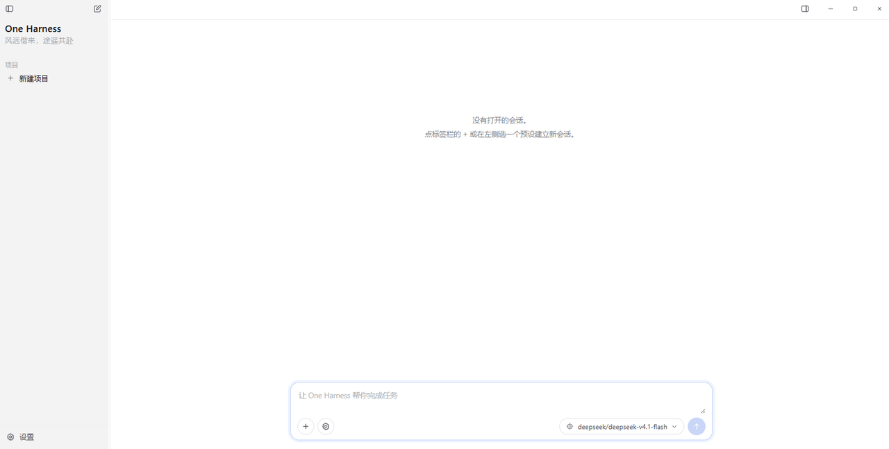

# One Harness

> 风远偕来，途遥共赴

跑在本机的桌面 agent harness。接 OpenAI 兼容端点，让模型读写文件、执行命令、联网取资料。

Electron + 纯 JS/HTML/CSS，无构建步骤。



## 快速开始

```bash
npm install
npm start
```

需要一个 OpenAI 兼容端点，在「设置 → 常规」里填 Base URL、API Key、模型名，点「拉取模型列表」确认连通。

首次启动会创建 `data/`、建一个默认项目，工作目录指向 `data/projects/<id>/workspace`。

## 功能

### 内核

- **事件日志**：追加式（`id` / `previousId` 链），支持从任意消息分叉出独立历史线
- **程序预设**：6 个（Omni / Coder / Coder-safe / Researcher / Chat / Blank）
- **能力模块**：8 个（文件 / Shell / Python / 联网 / 技能 / 检查点 / 压缩 / 评审），
  模块决定暴露哪些工具，共 12 个工具
- **审批闸门**：三层 —— 硬拒绝清单 → 正则风险分级 → 评审子会话
- **检查点**：写文件前自动存快照（内容寻址 `blobs/<sha256>`），可按消息回滚、可单文件恢复
- **上下文压缩**：接近容量上限时自动压缩，阈值 0.9375
- **技能**：扫描 `SKILL.md`，系统提示只注入名字与描述，模型按需读取
- **运行日志**：`logs/run-YYYY-MM-DD.log`，按天分文件、只追加不覆盖。
  每行一条 JSON（JSONL），记模型请求的耗时与 token、每次工具调用的参数 / 耗时 / 成败、
  闸门裁决、轮次起止与被中止的原因。`apiKey` 等敏感字段自动打码。
  排查"请求停不下来"这类问题时看它 —— 能分清是在干活还是在原地打转。
  设 `HATCH_RUN_LOG=0` 可整体关闭。

### 审批闸门

每次工具调用过三道：

1. **硬拒绝清单** —— 回不去根目录、裸设备、管道执行远程脚本等，直接拒
2. **正则风险分级** —— `low / medium / high / too_destructive`
3. **评审子会话** —— 中间那批交给一个小模型带只读工具去取证，输出三轴结论：
   `risk`（风险）/ `authorization`（用户授权了吗）/ `correct`（命令本身对不对）

四种模式：跟随全局、自动放行、评审子会话、每次询问。会话级可覆盖全局，**运行中也立即生效**。

评审坏了不会放行 —— 默认转人工，宁可停下来问。

### 界面

无边框窗口，三栏：

| 区域 | 内容 |
|---|---|
| 左 | 项目树（项目 + 其下会话，可折叠、可删除）→ 底部设置 |
| 中 | 会话标签栏 → 消息时间线 → 输入卡片（新建会话 / 审批模式 / 模型 / 发送）→ 用量明细 |
| 右 | 浏览器 / 文件 / 技能 / 工具 |

- **内置浏览器**：地址栏 + 前进后退刷新。网址自动补 `http://`，`localhost:3000` 直接认，
  本地路径转 `file://`，普通文字当搜索词。跑在独立 guest 进程里，只允许 http/https/file。
- **点文件名即可查看**：正文和工具卡里的文件名都可点。`.html` 交给内置浏览器渲染，
  其余打开**带行号的文本视图**。只给文件名不给目录时，会在工作目录、项目目录里找，
  也会去改动记录里按文件名反查。
- **文件类型图标**：按扩展名分网页 / 代码 / 数据 / 文档 / 图片，认不出退通用图标。
- **改动记录**：每个文件一行（新建的 / 改过 ×N），可恢复到改动前。
- **消息操作**：悬停出现复制、从这条分叉；用户消息另有回滚到此处。
- **回合摘要**：本轮耗时 + 每个被改文件的增删行数。
- **布局持久化**：栏宽、折叠状态、右栏页签、当前项目、标签、窗口位置尺寸写入 `data/ui-state/`。
- **设置**：左栏左下角入口，模态框，分区表单各自独立保存。

## 安全模型

- **渲染层与内核隔离**：`contextIsolation` 开、`nodeIntegration` 关，所有能力经 preload 白名单暴露。
- **审批闸门是默认路径**：任何写操作、命令执行都要过闸门；`too_destructive` 一律拒绝。
- **内置浏览器**：guest 进程不给 preload、无 node 集成、只允许 http/https/file。
- **数据全在本机**：会话、检查点、设置都在 `data/`，没有外部服务。

## 测试

```bash
npm test                    # 下面四层跑一遍
npm run smoke               # 97 项：假模型服务跑通整轮，不需要真模型
npm run test:ui             # 26 项：真起 Electron 点界面，断言"点了要有反应"
npm run test:mouse          # 45 项：真实鼠标输入，断言"这个控件真人点得到"
npm run test:approval-mode  # 10 项：运行中切审批模式必须对下一次调用生效
npm run test:features       # 131 项：真模型端到端 + 全部面板走查
npm run launch-check        # 主进程 + preload + 渲染层能否起来
```

`test:ui` 和 `test:mouse` 分工不同：前者用 `el.click()`，能覆盖业务链路但**绕过命中测试**；
后者走 Chromium 命中测试发真实输入，**"按钮点不到"这类问题只有它能测出来**，
并附带一遍全量体检（枚举每个可见交互元素做命中测试）。

自动化跑法都不显示窗口。要出图才设 `HATCH_SHOT_VISIBLE=1`。

## 已知限制

- 未做 RAG、插件沙箱、MCP
- 联网搜索需自配 SearxNG 端点（`web_fetch` 开箱可用）
- Python 走本机解释器，不是沙箱
- 目前跑源码，未打包成安装程序
- 界面只有浅色主题
